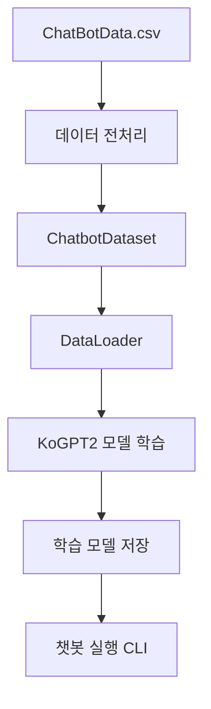

# 🤖 AI 챗봇 프로젝트 (KoGPT2 기반 대화형 모델)

> **비전공자 → AI·백엔드 전반을 주도적으로 수행한 학원 프로젝트**
> 한국어 GPT-2(KoGPT2)를 활용한 **대화형 챗봇 학습·서빙 시스템 구현**

---

## 📌 프로젝트 개요

* **프로젝트 목적**
  한국어 자연어 처리 모델(KoGPT2)을 활용하여 사용자와 자연스러운 대화가 가능한 챗봇 시스템을 구축

* **진행 배경**
  2022년 학원 과정 중 *AI 모델을 실제로 학습·적용해보자*는 목표로 진행된 팀 프로젝트

* **프로젝트 형태**
  팀 프로젝트 (총 4명)

* **기간**
  2022년

---

## 👨‍💻 담당 역할 (본인 기여도)

> **팀장 / 백엔드 / AI 모델 학습 및 적용 전담**

* 팀 리딩 및 전체 일정 관리
* 챗봇 **AI 모델 학습 파이프라인 설계 및 구현**
* KoGPT2 기반 대화 데이터 전처리 로직 개발
* PyTorch 기반 모델 학습 코드 작성
* 학습된 모델을 활용한 **CLI 챗봇 실행 환경 구현**
* 백엔드 구조 설계 및 API 흐름 정리
* 팀원 기술적 이슈 해결 및 코드 리뷰 주도

➡️ **프론트엔드, 백엔드, AI 모델 전반을 포지션 구분 없이 주도적으로 수행**

---

## 🛠️ 기술 스택

### AI / 데이터

* Python
* PyTorch
* HuggingFace Transformers
* KoGPT2 (`skt/kogpt2-base-v2`)
* Pandas, NumPy

### 백엔드 / 실행 환경

* Python
* Torch Dataset / DataLoader

### 협업

* Git / GitHub

---

## 🧠 시스템 아키텍처



---

## 📂 주요 기능 설명

### 1️⃣ 데이터 전처리 (ChatbotDataset)

* 질문(Q) / 답변(A) 데이터 분리
* 특수 토큰 기반 대화 포맷 구성

  * `<usr>` : 사용자
  * `<sys>` : 챗봇 응답
* 최대 길이 초과 시 동적 Truncation 적용
* 마스크(mask) 기반 Loss 계산 구조 설계

```text
[질문] <usr> 질문 <unused1>
[답변] <sys> 답변 </s>
```

---

### 2️⃣ 모델 학습

* KoGPT2 사전학습 모델 기반 Fine-tuning
* CrossEntropyLoss + Masking 처리
* GPU(CUDA) 환경 고려한 학습 구조
* Epoch 기반 반복 학습 및 Loss 로그 출력

```python
avg_loss = loss.sum() / mask.sum()
avg_loss.backward()
```

---

### 3️⃣ 챗봇 실행 로직

* 학습된 모델 로드 후 실시간 질의응답
* 토큰 단위로 응답 생성
* EOS 토큰 감지 시 응답 종료

```text
user > 안녕하세요
mibot > 안녕하세요 무엇을 도와드릴까요?
```

---

## ✨ 프로젝트 성과

* 한국어 GPT 모델 학습 전체 사이클 **직접 구현 경험**
* 비전공자 출신으로 **AI 모델 학습·적용을 독자적으로 수행**
* 단순 모델 호출이 아닌 **데이터셋, 마스킹, Loss 구조까지 이해하고 설계**
* 팀 내 기술적 허브 역할 수행 (문제 해결 및 가이드)

---

## 💡 느낀 점

* AI 모델은 "불러다 쓰는 것"이 아니라 **데이터 설계가 핵심**이라는 점을 체감
* 모델 성능은 코드보다 **전처리와 학습 전략**에서 갈린다는 경험 확보
* 백엔드와 AI를 함께 이해할 수 있는 개발자로 성장하는 계기

---

## 🔮 확장 아이디어

* REST API 기반 챗봇 서버화
* 웹 UI 연동
* 사용자 대화 로그 기반 추가 학습
* 멀티 턴 대화 컨텍스트 강화

---

## 👤 Author

* **장원종**
* 역할: 팀장 / AI 모델 학습 / 백엔드 전반

---

> ⭐ *비전공자이지만, 기술의 경계를 두지 않고 끝까지 구현해낸 프로젝트*
